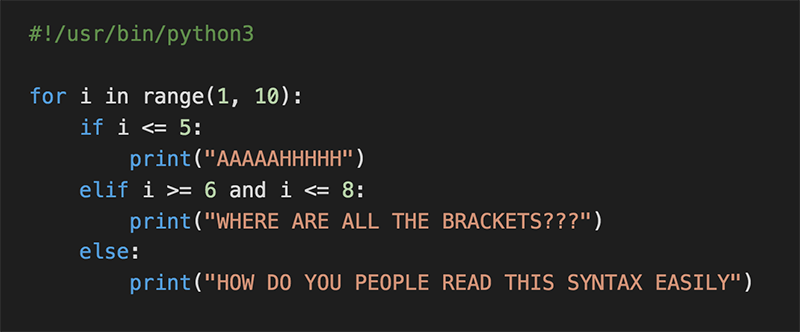

# 0x00. Python - Hello, World



## Resources

* [More Control Flow Tools](https://intranet.alxswe.com/rltoken/jpjs5EnZTpBLLEremJYjPQ) (Read until “4.6. Defining Functions” included)
* [IndentationError](https://intranet.alxswe.com/rltoken/F9n2AE-fpEPzt2PfBMGYAQ)
* [How To Use String Formatters in Python 3](https://intranet.alxswe.com/rltoken/ZdtRIAkFu8dMBT99DcFBNg)
* [Learn to Program](https://intranet.alxswe.com/rltoken/ElQgZYNHrLI7kV_ysEB1hQ)
* [Learn to Program 2 : Looping](https://intranet.alxswe.com/rltoken/ElQgZYNHrLI7kV_ysEB1hQ)
* [Pycodestyle – Style Guide for Python Code](https://intranet.alxswe.com/rltoken/TuTTnEg_Rwn8U1g3PEsZmA)

### Learning Objectives

* Why Python programming is awesome
* Why indentation is so important in Python
* How to use the ```if, if ... else``` statements
* How to use comments
* How to affect values to variables
* How to use the ```while``` and ```for``` loops
* How is Python’s ```for``` different from ```C```‘s?
* How to use the ```break``` and ```continues``` statements
* How to use ```else``` clauses on loops
* What does the ```pass``` statement do, and when to use it
* How to use ```range```
* What is a function and how do you use functions
* What does ```return``` a function that does not use any ```return``` statement
Scope of variables
* What’s a traceback
* What are the arithmetic operators and how to use them

## Requirements

### Python Scripts

* Editor used: ```Vs Code with Vim extension``` 😋
* All these files can be interpreted/compiled on Ubuntu 20.04 LTS using python3 (version 3.8.5)
* All these files end with a new line
* The first line of all these files are exactly ```#!/usr/bin/python3```
* These code uses pycodestyle (version ```2.8.*```)
* All these files have permissions to be executable
* The length of these files has been tested using ```wc```

### C Scripts

* Editor used: ```Vs Code with Vim extension``` 😋
* All these files can be compiled on Ubuntu 20.04 LTS using gcc, using the options ```-Wall -Werror -Wextra -pedantic -std=gnu89```
* All these files end with a new line
* These code uses the ```Betty``` style. It can be checked using [```betty-style.pl```](https://github.com/alx-tools/Betty/blob/master/betty-style.pl) and [```betty-doc.pl```](https://github.com/alx-tools/Betty/blob/master/betty-doc.pl)
* I have not used any global variables 🥴
* There are no more than five functions per file
* In the following examples, the ```main.c``` files are shown as examples. You can use them to test these functions. You can use any other ```main.c``` files at compilation.
* The prototypes of all these functions are included in the header file called ```lists.h```
* The header file(s) include guards

## Tasks

### 0. Positive anything is better than negative nothing

This program will assign a random signed ```number``` to the variable ```number``` each time it is executed. Complete the source code in order to print whether the number stored in the variable ```number``` is positive or negative.

* You can find the original source code [```here```](https://intranet.alxswe.com/rltoken/e4tR3cjFHqhelf4y485-zQ)
* The variable ```number``` will store a different value every time you will run this program
* This code is untouched ```import, random. randint```
* The output of the program is:
  * The number, followed by
    * if the number is greater than 0: ```is positive```
    * if the number is 0: ```is zero```
    * if the number is less than 0: ```is negative```
  * followed by a new line

```py
guillaume@ubuntu:~/0x01$ ./0-positive_or_negative.py 
-4 is negative
guillaume@ubuntu:~/0x01$ ./0-positive_or_negative.py 
0 is zero
guillaume@ubuntu:~/0x01$ ./0-positive_or_negative.py 
-3 is negative
guillaume@ubuntu:~/0x01$ ./0-positive_or_negative.py 
-10 is negative
guillaume@ubuntu:~/0x01$ ./0-positive_or_negative.py 
10 is positive
guillaume@ubuntu:~/0x01$ ./0-positive_or_negative.py 
-5 is negative
guillaume@ubuntu:~/0x01$ ./0-positive_or_negative.py 
6 is positive
guillaume@ubuntu:~/0x01$ ./0-positive_or_negative.py 
7 is positive
guillaume@ubuntu:~/0x01$ ./0-positive_or_negative.py 
5 is positive
guillaume@ubuntu:~/0x01$
```

### 1. The last digit

This program will assign a random signed ```number``` to the variable number each time it is executed. Complete the source code in order to print the last digit of the number stored in the variable ```number```.

* You can find the original source code [```here```](https://intranet.alxswe.com/rltoken/Vku0ZPFeDPuXUKD8nZ4mOQ)
* The variable ```number``` will store a different value every time you will run this program
* **Please do not touch this code**... ```import, random.randint``` do.  This line should not change: ```number = random.randint(-10000, 10000)```
* The output of the program is:
  * The string ```Last digit of,``` followed by
  * the number, followed by
  * the string ```is```, followed by the last digit of ```number```, followed by
    * if the last digit is greater than 5: the string ```and is greater than 5```
    * if the last digit is 0: the string ```and is 0```
    * if the last digit is less than 6 and not 0: the string ```and is less than 6 and not 0```
followed by a new line

```py
guillaume@ubuntu:~/0x01$ ./1-last_digit.py
Last digit of 4205 is 5 and is less than 6 and not 0
guillaume@ubuntu:~/0x01$ ./1-last_digit.py
Last digit of -626 is -6 and is less than 6 and not 0
guillaume@ubuntu:~/0x01$ ./1-last_digit.py
Last digit of 1144 is 4 and is less than 6 and not 0
guillaume@ubuntu:~/0x01$ ./1-last_digit.py
Last digit of -9200 is 0 and is 0
guillaume@ubuntu:~/0x01$ ./1-last_digit.py
Last digit of 5247 is 7 and is greater than 5
guillaume@ubuntu:~/0x01$ ./1-last_digit.py
Last digit of -9318 is -8 and is less than 6 and not 0
guillaume@ubuntu:~/0x01$ ./1-last_digit.py
Last digit of 3369 is 9 and is greater than 5
guillaume@ubuntu:~/0x01$ ./1-last_digit.py
Last digit of -5224 is -4 and is less than 6 and not 0
guillaume@ubuntu:~/0x01$ ./1-last_digit.py
Last digit of -4485 is -5 and is less than 6 and not 0
guillaume@ubuntu:~/0x01$ ./1-last_digit.py
Last digit of 3850 is 0 and is 0
guillaume@ubuntu:~/0x01$ ./1-last_digit.py
Last digit of 5169 is 9 and is greater than 5
guillaume@ubuntu:~/0x01$
```

### 2. I sometimes suffer from insomnia. And when I can't fall asleep, I play what I call the alphabet game

Write a program that prints the ASCII alphabet, in lowercase, not followed by a new line.

* ```print``` with string format is used  😋
* The use loop is limited to single use
* No characters are stored in a variable 🥴
* No modules imported to help me around 🥴

```py
guillaume@ubuntu:~/0x01$ ./2-print_alphabet.py
abcdefghijklmnopqrstuvwxyzguillaume@ubuntu:~/0x01$
```

### 3. When I was having that alphabet soup, I never thought that it would pay off

Write a program that prints the ASCII alphabet, in lowercase, not followed by a new line.

* Prints all the letters except ```q``` and ```e```
* ```print``` with string format is used  😋
* The use loop is limited to one use only
* No characters are stored in a variable 🥴
* No modules imported to help me around 🥴

```py
guillaume@ubuntu:~/0x01$ ./3-print_alphabt.py
abcdfghijklmnoprstuvwxyzguillaume@ubuntu:~/0x01$
```

### 4. Hexadecimal printing

Write a program that prints all numbers from ```0``` to ```98``` in decimal and in hexadecimal (as in the following example)

* Only one ```print``` with string format is used  😋
* The use loop is limited to one use only
* No characters are stored in a variable 🥴
* No modules imported to help me around 🥴

```py
guillaume@ubuntu:~/0x01$ ./4-print_hexa.py
0 = 0x0
1 = 0x1
2 = 0x2
3 = 0x3
4 = 0x4
5 = 0x5
6 = 0x6
7 = 0x7
8 = 0x8
9 = 0x9
10 = 0xa
11 = 0xb
12 = 0xc
13 = 0xd
14 = 0xe
15 = 0xf
16 = 0x10
17 = 0x11
18 = 0x12
...
96 = 0x60
97 = 0x61
98 = 0x62
guillaume@ubuntu:~/0x01$
```

### 5. 00...99

Write a program that prints numbers from ```0``` to ```99```.

* Numbers are separated by ```,```, followed by a space
* Numbers are be printed in ascending order, with two digits
* The last number is followed by a new line
* Not more than two ```print``` with string format is used  😋
* The use loop is limited to one use only 🥴
* No characters are stored in a variable 🥴
* No modules imported to help me around 🥴

```py
guillaume@ubuntu:~/0x01$ ./5-print_comb2.py
00, 01, 02, 03, 04, 05, 06, 07, 08, 09, 10, 11, 12, 13, 14, 15, 16, 17, 18, 19, 20, 21, 22, 23, 24, 25, 26, 27, 28, 29, 30, 31, 32, 33, 34, 35, 36, 37, 38, 39, 40, 41, 42, 43, 44, 45, 46, 47, 48, 49, 50, 51, 52, 53, 54, 55, 56, 57, 58, 59, 60, 61, 62, 63, 64, 65, 66, 67, 68, 69, 70, 71, 72, 73, 74, 75, 76, 77, 78, 79, 80, 81, 82, 83, 84, 85, 86, 87, 88, 89, 90, 91, 92, 93, 94, 95, 96, 97, 98, 99
guillaume@ubuntu:~/0x01$
```

### 6. Inventing is a combination of brains and materials. The more brains you use, the less material you need

Write a program that prints all possible different combinations of two digits.

* Numbers are separated by ```,```, followed by a space
* The two digits must be different
* ```01``` and ```10``` are considered the same combination of the two digits ```0``` and ```1```
* Print only the smallest combination of two digits
* Numbers should be printed in ascending order, with two digits
* The last number is followed by a new line
* Only not more than three ```print``` with string format is used  😋
* The use loop is limited to two uses only 🥴
* No characters are stored in a variable 🥴
* No modules imported to help me around 🥴

```py
guillaume@ubuntu:~/0x01$ ./6-print_comb3.py
01, 02, 03, 04, 05, 06, 07, 08, 09, 12, 13, 14, 15, 16, 17, 18, 19, 23, 24, 25, 26, 27, 28, 29, 34, 35, 36, 37, 38, 39, 45, 46, 47, 48, 49, 56, 57, 58, 59, 67, 68, 69, 78, 79, 89
guillaume@ubuntu:~/0x01$
```

### 7. islower

Write a function that checks for lowercase character.

* Prototype: ```def islower(c):```
* Returns ```True``` if ```c``` is lowercase
* Returns ```False``` otherwise
* No modules imported to help me around 🥴
* No ```str.upper()``` and ```str.isupper()``` is used 🥴
* ```Tips: ord()```

```py
guillaume@ubuntu:~/0x01$ cat 7-main.py
#!/usr/bin/env python3
islower = __import__('7-islower').islower

print("a is {}".format("lower" if islower("a") else "upper"))
print("H is {}".format("lower" if islower("H") else "upper"))
print("A is {}".format("lower" if islower("A") else "upper"))
print("3 is {}".format("lower" if islower("3") else "upper"))
print("g is {}".format("lower" if islower("g") else "upper"))

guillaume@ubuntu:~/0x01$ ./7-main.py
a is lower
H is upper
A is upper
3 is upper
g is lower
guillaume@ubuntu:~/0x01$
```

### 8. To uppercase

Write a function that prints a string in uppercase followed by a new line.

* Prototype: ```def uppercase(str):```
* Only not more than two ```print``` with string format is used  😋
* The use loop is limited to one use only 🥴
* No modules imported to help me around 🥴
* No ```str.upper()``` and ```str.isupper()``` is used 🥴
* ```Tips: ord()```

```py
guillaume@ubuntu:~/0x01$ cat 8-main.py
#!/usr/bin/env python3
uppercase = __import__('8-uppercase').uppercase

uppercase("best")
uppercase("Best School 98 Battery street")

guillaume@ubuntu:~/0x01$ ./8-main.py
BEST
BEST SCHOOL 98 BATTERY STREET
guillaume@ubuntu:~/0x01$
```

### 9. There are only 3 colors, 10 digits, and 7 notes; it's what we do with them that's important

Write a function that prints the last digit of a number.

* Prototype: ```def print_last_digit(number):```
* Returns the value of the last digit
* No modules imported to help me around 🥴

```py
guillaume@ubuntu:~/0x01$ cat 9-main.py
#!/usr/bin/env python3
print_last_digit = __import__('9-print_last_digit')print_last_digit

print_last_digit(98)
print_last_digit(0)
r = print_last_digit(-1024)
print(r)

guillaume@ubuntu:~/0x01$ ./9-main.py
8044
guillaume@ubuntu:~/0x01$
```

### 10. a + b

Write a function that adds two integers and returns the result.

* Prototype: ```def add(a, b):```
* Returns the value of ```a + b```
* No modules imported to help me around 🥴

```py
guillaume@ubuntu:~/0x01$ cat 10-main.py
#!/usr/bin/env python3
add = __import__('10-add').add

print(add(1, 2))
print(add(98, 0))
print(add(100, -2))

guillaume@ubuntu:~/0x01$ ./10-main.py
3
98
98
guillaume@ubuntu:~/0x01$
```

### 11. a ^ b

Write a function that computes ```a``` to the power of ```b``` and return the value.

* Prototype: ```def pow(a, b):```
* Returns the value of ```a ^ b```

```py
guillaume@ubuntu:~/0x01$ cat 11-main.py
#!/usr/bin/env python3
pow = __import__('11-pow').pow

print(pow(2, 2))
print(pow(98, 2))
print(pow(98, 0))
print(pow(100, -2))
print(pow(-4, 5))

guillaume@ubuntu:~/0x01$ ./11-main.py
4
9604
1
0.0001
-1024
guillaume@ubuntu:~/0x01$
```

### 12. Fizz Buzz

Write a function that prints the numbers from 1 to 100 separated by a space.

* For multiples of three print ```Fizz``` instead of the number and for multiples of five print ```Buzz```.
* For numbers which are multiples of both three and five print ```FizzBuzz```.
* Prototype: ```def fizzbuzz():```
* Each element is followed by a space
* No modules imported to help me around 🥴

```py
0000000 ee 0c 0d 0a 91 26 3e 58 31 00 00 00 e3 00 00 00
0000020 00 00 00 00 00 00 00 00 00 02 00 00 00 40 00 00
0000040 00 73 0e 00 00 00 65 00 00 64 00 00 83 01 00 01
0000060 64 01 00 53 29 02 7a 10 48 6f 6c 62 65 72 74 6f
0000100 6e 20 53 63 68 6f 6f 6c 4e 29 01 da 05 70 72 69
0000120 6e 74 a9 00 72 02 00 00 00 72 02 00 00 00 fa 07
0000140 6d 61 69 6e 2e 70 79 da 08 3c 6d 6f 64 75 6c 65
0000160 3e 02 00 00 00 73 00 00 00 00
0000172
```

### 13. Insert in sorted linked list

**Technical interview preparation:**

* Whiteboard first
Write a function in C that inserts a number into a sorted singly linked list.

* Prototype: ```listint_t *insert_node(listint_t **head, int number);```
* Return: the address of the new node, or ```NULL``` if it failed
* Run it with: ```gcc -Wall -Werror -Wextra -pedantic -std=gnu89 13-main.c linked_lists.c 13-insert_number.c -o insert```

```py
carrie@ubuntu:0x01$ gcc -Wall -Werror -Wextra -pedantic -std=gnu89 13-main.c linked_lists.c 13-insert_number.c -o insert
carrie@ubuntu:0x01$ ./insert
0
1
2
3
4
98
402
1024
-----------------
0
1
2
3
4
27
98
402
1024
carrie@ubuntu:0x01$
```

### 14. Smile in the mirror

Write a program that prints the ASCII alphabet, in reverse order, alternating lowercase and uppercase (```z``` in lowercase and ```Y``` in uppercase) , not followed by a new line.

* You can only use one ```print``` function with string format
* Only two ```print``` functions with string format is used  😋
* You can only use one loop in your code
* You are not allowed to store characters in a variable
* You are not allowed to import any module

```py
guillaume@ubuntu:~/0x01$ ./100-print_tebahpla.py
zYxWvUtSrQpOnMlKjIhGfEdCbAguillaume@ubuntu:~/0x01$
```

### 15. Remove at position

Write a function that creates a copy of the string, removing the character at the position ```n```(not the Python way, the “C array index”).

* Prototype: ```def remove_char_at(str, n):```

```py
guillaume@ubuntu:~/0x01$ cat 101-main.py
#!/usr/bin/env python3
remove_char_at = __import__('101-remove_char_at').remove_char_at

print(remove_char_at("Best School", 3))
print(remove_char_at("Chicago", 2))
print(remove_char_at("C is fun!", 0))
print(remove_char_at("School", 10))
print(remove_char_at("Python", -2))

guillaume@ubuntu:~/0x01$ ./101-main.py
Bes School
Chcago
 is fun!
School
Python
guillaume@ubuntu:~/0x01$
```

### 16. ByteCode -> Python #2

Write the Python function ```def magic_calculation(a, b, c):``` that does exactly the same as the following Python bytecode:

```py
  3           0 LOAD_FAST                0 (a)
              3 LOAD_FAST                1 (b)
              6 COMPARE_OP               0 (<)
              9 POP_JUMP_IF_FALSE       16

  4          12 LOAD_FAST                2 (c)
             15 RETURN_VALUE

  5     >>   16 LOAD_FAST                2 (c)
             19 LOAD_FAST                1 (b)
             22 COMPARE_OP               4 (>)
             25 POP_JUMP_IF_FALSE       36

  6          28 LOAD_FAST                0 (a)
             31 LOAD_FAST                1 (b)
             34 BINARY_ADD
             35 RETURN_VALUE

  7     >>   36 LOAD_FAST                0 (a)
             39 LOAD_FAST                1 (b)
             42 BINARY_MULTIPLY
             43 LOAD_FAST                2 (c)
             46 BINARY_SUBTRACT
             47 RETURN_VALUE
```

**coded with lots of love 😘 to:**
The Queen of my heart ~ 🥰 Centrine Adioz 🥰
