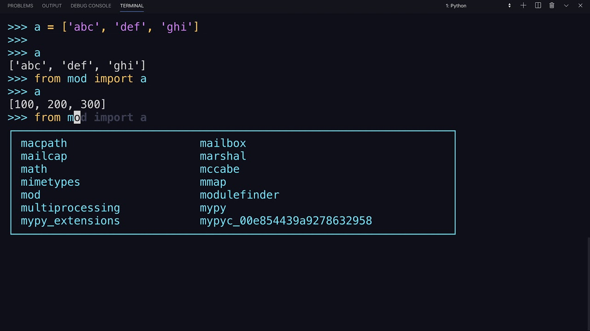

# 



## Resources

* [Modules](https://intranet.alxswe.com/rltoken/SY-cMfnwbHoPFaJ-D_LWig)
* [Command line arguments](https://intranet.alxswe.com/rltoken/5e3TphtJ6WSVkWsdd2eX_A)
* [Pycodestyle – Style Guide for Python Code](https://intranet.alxswe.com/rltoken/FlkAJ_kPXHC4Y65WrRvA4A)

### Learning Objectives

* Why Python programming is awesome
* How to import functions from another file
* How to use imported functions
* How to create a module
* How to use the built-in function ```dir()```
* How to prevent code in your script from being executed when imported
* How to use command line arguments with your Python programs

## Requirements

### General

* Allowed editors: ```vi, vim, emacs```
* All the files will be interpreted/compiled on Ubuntu 20.04 LTS using python3 (version 3.8.5)
* All the files end with a new line
* The first line of all the files are exactly ```#!/usr/bin/python3```
* A ```README.md``` file, at the root of the folder of the project, is mandatory
* The code is using the pycodestyle (version ```2.8.*```)
* All the files are executable (given execution permission)
* The length of the files can be tested using ```wc```

## Tasks

### 0. Import a simple function from a simple file

This is a program that imports the function ```def add(a, b):``` from the file ```add_0.py``` and prints the result of the addition ```1 + 2 = 3```

* I have used ```print``` function with string format to display integers
* I have assigned:
  * the value ```1``` to a variable called ```a```
  * the value ```2``` to a variable called ```b```
  * and use those two variables as arguments when calling the functions ```add``` and ```print```
* ```a``` and ```b``` are defined in 2 different lines: ```a = 1``` and another ```b = 2```
* The program prints: ```<a value> + <b value> = <add(a, b) value>``` followed with a new line
* The word ```add_0``` is only used once in this code 😋
* I have not used ```*``` for importing or ```__import__``` 🥴
* This code can't execute when imported - by using ```__import__```, like the example below:

```py
guillaume@ubuntu:~/0x02$ cat add_0.py
#!/usr/bin/python3
def add(a, b):
    """My addition function

    Args:
        a: first integer
        b: second integer

    Returns:
        The return value. a + b
    """
    return (a + b)

guillaume@ubuntu:~/0x02$ ./0-add.py
1 + 2 = 3
guillaume@ubuntu:~/0x02$ cat 0-import_add.py
__import__("0-add")
guillaume@ubuntu:~/0x02$ python3 0-import_add.py
guillaume@ubuntu:~/0x02$
```

### 1. My first toolbox

This is a program that imports functions from the file ```calculator_1.py```, does some Maths, and prints the result.

* ```print``` (with string format to display integers) is not used more than 4 times
* Definitions:
  * the value ```10``` to a variable ```a```
  * the value ```5``` to a variable ```b```
  * only the above variables are used as arguments when calling functions (including ```print```)
* ```a``` and ```b``` are defined in 2 different lines: ```a = 10``` and another ```b = 5```
* The program calls each of the imported functions. **See example below for format**
* the word ```calculator_1``` is used only once in your file 😋
* I have not used ```*``` for importing or ```__import__``` 🥴
* This code can't execute when imported - by using ```__import__```, like the example below:

```py
guillaume@ubuntu:~/0x02$ cat calculator_1.py
#!/usr/bin/python3
def add(a, b):
    """My addition function

    Args:
        a: first integer
        b: second integer

    Returns:
        The return value. a + b
    """
    return (a + b)


def sub(a, b):
    """My subtraction function

    Args:
        a: first integer
        b: second integer

    Returns:
        The return value. a - b
    """
    return (a - b)


def mul(a, b):
    """My multiplication function

    Args:
        a: first integer
        b: second integer

    Returns:
        The return value. a * b
    """
    return (a * b)


def div(a, b):
    """My division function

    Args:
        a: first integer
        b: second integer

    Returns:
        The return value. a / b
    """
    return int(a / b)

guillaume@ubuntu:~/0x02$ ./1-calculation.py
10 + 5 = 15
10 - 5 = 5
10 * 5 = 50
10 / 5 = 2
guillaume@ubuntu:~/0x02$
```

### 2. How to make a script dynamic

This is a program that prints the number of and the list of its arguments.

* The output is:
  * Number of argument(s) followed by ```argument``` (if number is one) or ```arguments``` (otherwise), followed by
  * ```:``` (or ```.``` if no arguments were passed) followed by
  * a new line, followed by (if at least one argument),
  * one line per argument:
    * the position of the argument (starting at ```1```) followed by ```:```, followed by the argument value and a new line
* This code can't execute when imported 🥴
* The number of elements of ```argv``` can be retrieved by using: ```len(argv)```

```py
guillaume@ubuntu:~/0x02$ ./2-args.py 
0 arguments.
guillaume@ubuntu:~/0x02$ ./2-args.py Hello
1 argument:
1: Hello
guillaume@ubuntu:~/0x02$ ./2-args.py Hello Welcome To The Best School
6 arguments:
1: Hello
2: Welcome
3: To
4: The
5: Best
6: School
guillaume@ubuntu:~/0x02$
```

### 3. Infinite addition

This is a program that prints the result of the addition of all arguments

* The output is the result of the addition of all arguments, followed by a new line
* I have cast arguments into integers by using ```int()``` (I have assumed that all arguments can be casted into integers) 😋
* This code can't execute when imported 🥴

**First example:**

```py
guillaume@ubuntu:~/0x02$ ./3-infinite_add.py
0
guillaume@ubuntu:~/0x02$ ./3-infinite_add.py 79 10
89
guillaume@ubuntu:~/0x02$ ./3-infinite_add.py 79 10 -40 -300 89
-162
guillaume@ubuntu:~/0x02$
```

Last but not least, this program can handle really huge numbers. And the good news is: if your program works for the above example, it will work for the following example:

**Second example:**

```py
guillaume@ubuntu:~/0x02$ ./3-infinite_add.py 1111111111111111111111111111111111111111111111111111111111112222222222222222222222222222222222223435467866765443534434222222254444444444444444444444444444444444444444444444444444444444444444444444444444444444444444444444444444555555555555555555555555555555555555555555555555555555555555555555555555555555555555555555555555555555555555555555555555555555555555555555555555555555666666666666666666666666666666777777777777777777777777777777888888888888888888888888888888899999999999999999999999990000000000000000000 11111111111111111111111111111111111111111111111111222222222222222222222222222333333333333333333334567788888899999999999999999999999999999999999999999999999999999999999999999999999999999999999999999999999999999999999999999999999999999999999999999999999999999999999999999999999999999999999999999999999999999999999999999999999999999999999999999999999999999999999999999999999999999999999999999999999999999999999999999999999999999999999999999999999999999999999999999999999999999999999999999999999999999999999999999999999999999999999999999999999999999999999999999999999999999999999999999999999999999999999999999999999
11111111111111111111111111111111111111111111111111222222222222222222222222222333333333333333333334568900000011111111111111111111111111111111111111111111111111112222222222222222222222222222222222223435467866765443534434222222254444444444444444444444444444444444444444444444444444444444444444444444444444444444444444444444444444555555555555555555555555555555555555555555555555555555555555555555555555555555555555555555555555555555555555555555555555555555555555555555555555555555666666666666666666666666666666777777777777777777777777777777888888888888888888888888888888899999999999999999999999989999999999999999999
guillaume@ubuntu:~/0x02$
```

Remember how you did (or did not) do it in C? ```#pythoniscool```


### 4. Who are you?

This is a program that prints all the names defined by the compiled module [```hidden_4.pyc```](https://github.com/alx-tools/0x02.py/raw/master/hidden_4.pyc) (please download it locally).

* It prints one name per line, in alpha order
* It prints only names that do not start with ```__```
* This code can't execute when imported 🥴
* This code is running in Python3.8.x 😋

```py
guillaume@ubuntu:~/0x02$ curl -Lso "hidden_4.pyc" "https://github.com/alx-tools/0x02.py/raw/master/hidden_4.pyc"
guillaume@ubuntu:~/0x02$ ./4-hidden_discovery.py | sort
my_secret_santa
print_hidden
print_school
guillaume@ubuntu:~/0x02$
```

### 5. Everything can be imported

This is a program that imports the variable ```a``` from the file ```variable_load_5.py``` and prints its value.

* I have not used ```*``` for importing or ```__import__``` 🥴
* This code can't execute when imported 🥴

```py
guillaume@ubuntu:~/0x02$ cat variable_load_5.py
#!/usr/bin/python3
a = 98
"""Simple variable
"""

guillaume@ubuntu:~/0x02$ ./5-variable_load.py
98
guillaume@ubuntu:~/0x02$
```

### 6. Build my own calculator

This is a program that imports all functions from the file ```calculator_1.py``` and handles basic operations.

* Usage: ```./100-my_calculator.py a operator b```
  * If the number of arguments is not 3, your program has to:
    * print ```Usage: ./100-my_calculator.py <a> <operator> <b>``` followed with a new line
    * exit with the value ```1```
  * ```operator``` can be:
    * ```+``` for addition
    * ```-``` for subtraction
    * ```*``` for multiplication
    * ```/``` for division
  * If the operator is not one of the above:
    * print ```Unknown operator. Available operators: +, -, * and /``` followed with a new line
    * exit with the value ```1```
  * You can cast ```a``` and ```b``` into integers by using ```int()``` (you can assume that all arguments will be castable into integers)
  * The result should be printed like this: ```<a> <operator> <b> = <result>```, followed by a new line
* I have not used ```*``` for importing or ```__import__``` 🥴
* This code can't execute when imported 🥴

```py
guillaume@ubuntu:~/0x02$ cat calculator_1.py
#!/usr/bin/python3
def add(a, b):
    """My addition function

    Args:
        a: first integer
        b: second integer

    Returns:
        The return value. a + b
    """
    return (a + b)


def sub(a, b):
    """My subtraction function

    Args:
        a: first integer
        b: second integer

    Returns:
        The return value. a - b
    """
    return (a - b)


def mul(a, b):
    """My multiplication function

    Args:
        a: first integer
        b: second integer

    Returns:
        The return value. a * b
    """
    return (a * b)


def div(a, b):
    """My division function

    Args:
        a: first integer
        b: second integer

    Returns:
        The return value. a / b
    """
    return int(a / b)

guillaume@ubuntu:~/0x02$ ./100-my_calculator.py ; echo $?
Usage: ./100-my_calculator.py <a> <operator> <b>
1
guillaume@ubuntu:~/0x02$ ./100-my_calculator.py 3 + 5 ; echo $?
3 + 5 = 8
0
guillaume@ubuntu:~/0x02$ ./100-my_calculator.py 3 H 5 ; echo $?
Unknown operator. Available operators: +, -, * and /
1
guillaume@ubuntu:~/0x02$
```

### 7. Easy print

This is a program that prints ```#pythoniscool```, followed by a new line, in the standard output.

* This program has a maximum 2 lines long
* I have not used ```print``` or ```eval``` or ```open``` or ```import sys```

```py
guillaume@ubuntu:~/0x02$ ./101-easy_print.py
#pythoniscool
guillaume@ubuntu:~/0x02$
```

### 8. ByteCode -> Python #3

This is a Python function ```def magic_calculation(a, b):``` that does exactly the same as the following Python bytecode:

```py
  3           0 LOAD_CONST               1 (0)
              3 LOAD_CONST               2 (('add', 'sub'))
              6 IMPORT_NAME              0 (magic_calculation_102)
              9 IMPORT_FROM              1 (add)
             12 STORE_FAST               2 (add)
             15 IMPORT_FROM              2 (sub)
             18 STORE_FAST               3 (sub)
             21 POP_TOP

  4          22 LOAD_FAST                0 (a)
             25 LOAD_FAST                1 (b)
             28 COMPARE_OP               0 (<)
             31 POP_JUMP_IF_FALSE       94

  5          34 LOAD_FAST                2 (add)
             37 LOAD_FAST                0 (a)
             40 LOAD_FAST                1 (b)
             43 CALL_FUNCTION            2 (2 positional, 0 keyword pair)
             46 STORE_FAST               4 (c)

  6          49 SETUP_LOOP              38 (to 90)
             52 LOAD_GLOBAL              3 (range)
             55 LOAD_CONST               3 (4)
             58 LOAD_CONST               4 (6)
             61 CALL_FUNCTION            2 (2 positional, 0 keyword pair)
             64 GET_ITER
        >>   65 FOR_ITER                21 (to 89)
             68 STORE_FAST               5 (i)

  7          71 LOAD_FAST                2 (add)
             74 LOAD_FAST                4 (c)
             77 LOAD_FAST                5 (i)
             80 CALL_FUNCTION            2 (2 positional, 0 keyword pair)
             83 STORE_FAST               4 (c)
             86 JUMP_ABSOLUTE           65
        >>   89 POP_BLOCK

  8     >>   90 LOAD_FAST                4 (c)
             93 RETURN_VALUE

 10     >>   94 LOAD_FAST                3 (sub)
             97 LOAD_FAST                0 (a)
            100 LOAD_FAST                1 (b)
            103 CALL_FUNCTION            2 (2 positional, 0 keyword pair)
            106 RETURN_VALUE
            107 LOAD_CONST               0 (None)
            110 RETURN_VALUE
```

* **Tip:** [Python bytecode](https://intranet.alxswe.com/rltoken/FMdg7W8NKJZKRuFGG8mzmg)

### 9. Fast alphabet

This is a program that prints the alphabet in uppercase, followed by a new line.

* This program has a maximum 3 lines long
* I have not used 🥴:
  * any loops
  * any conditional statements
  * ```str.join()```
  * any string literal
  * any system calls

```py
guillaume@ubuntu:~/0x02$ ./103-fast_alphabet.py
ABCDEFGHIJKLMNOPQRSTUVWXYZ
guillaume@ubuntu:~/0x02$ wc -l 103-fast_alphabet.py
3 103-fast_alphabet.py
guillaume@ubuntu:~/0x02$
```


